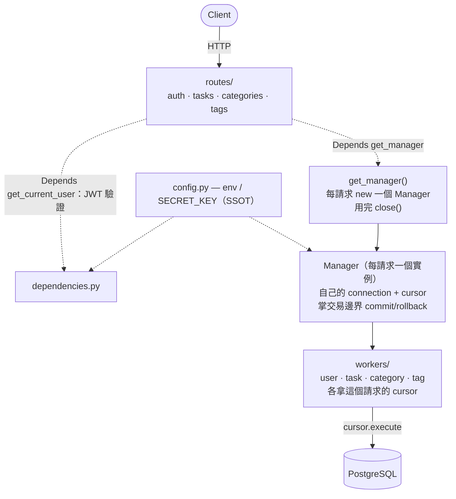
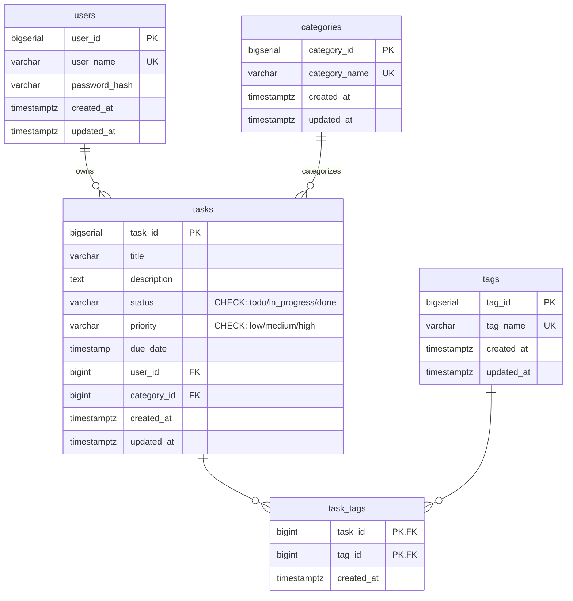
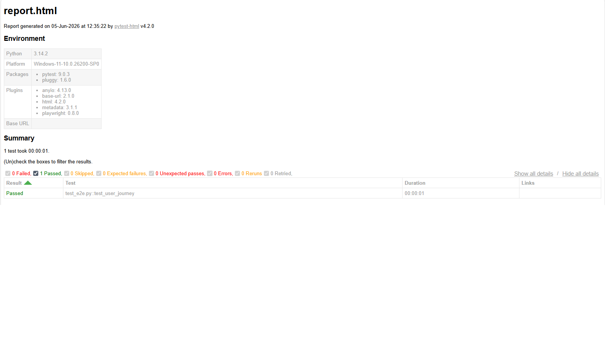

# Task-flow API

[](https://github.com/ENS999/task-flow/actions/workflows/test.yml)

任務管理系統，透過 FastAPI 實現 RESTful API。功能包含：任務 CRUD、分類與標籤管理、狀態流轉控制（done 不可回退）、篩選 / 排序 / 分頁、JWT 認證與授權、13 項整合測試與 Playwright 端對端測試。

A task management API built with FastAPI. Features include task CRUD, categories, tags, status flow control (todo → in_progress → done), filtering, sorting, pagination, and JWT authentication.

**Deployment:** Live on Render — https://task-flow-8la9.onrender.com

> The live URL serves a health-check endpoint. Interactive API docs (Swagger) are disabled in production as a security measure.
> See the API Endpoints table below, or run locally (see "How to Run") to explore the full docs at /docs.

---

## Tech Stack

- **Language:** Python 3.12
- **Framework:** FastAPI
- **Database:** PostgreSQL
- **Authentication:** JWT (python-jose + passlib bcrypt)
- **Validation:** Pydantic
- **Testing:** pytest (13 integration tests) + Playwright (E2E)
- **Containerization:** Docker
- **Deployment:** Render
- **CI:** GitHub Actions
- **Environment Config (dev/prod):** API docs, CORS, error handling

---

## Architecture

採 Manager-Worker 分層：Manager 掌交易邊界（commit/rollback），Worker 專注 SQL 執行。
連線生命週期為 per-request — 每個請求透過 `get_manager` 依賴注入取得獨立的 connection 與 cursor，請求結束即關閉，確保交易邊界逐請求隔離、無跨請求共用狀態。



---

## Database Schema (ERD)

五張表：`users`、`categories`、`tags`、`tasks`、`task_tags`。
`tasks` 透過 FK 連到 `users` 與 `categories`；`task_tags` 為 tasks 與 tags 的多對多 junction table，複合主鍵 `(task_id, tag_id)`，刪除 task 時級聯刪除關聯。



---

## Project Structure

```
task-flow/
├── .github/
│   └── workflows/
│       └── test.yml        # CI: auto run tests
├── main.py
├── config.py           # Environment variables (SSOT)
├── manager.py          # Manager (business logic) + get_manager dependency
├── database.py
├── schemas.py
├── dependencies.py     # JWT token verification
├── workers/
│   ├── user_worker.py
│   ├── task_worker.py
│   ├── category_worker.py
│   └── tag_worker.py
├── routes/
│   ├── auth.py
│   ├── categories.py
│   ├── tasks.py
│   └── tags.py
├── test_app.py         # pytest integration tests
├── conftest.py         # E2E fixtures (server / clean_db / api)
├── test_e2e.py         # Playwright E2E test
├── Dockerfile
├── requirements.txt
├── .env.example
└── .dockerignore
```

---

## API Endpoints

| Method | Endpoint                         | Description          | Auth |
| ------ | -------------------------------- | -------------------- | ---- |
| POST   | `/register`                      | Register             | No   |
| POST   | `/login`                         | Login                | No   |
| POST   | `/tasks`                         | Create task          | Yes  |
| GET    | `/tasks`                         | Get all tasks        | Yes  |
| GET    | `/tasks/{task_id}`               | Get task by ID       | Yes  |
| PUT    | `/tasks/{task_id}`               | Update task          | Yes  |
| DELETE | `/tasks/{task_id}`               | Delete task          | Yes  |
| POST   | `/categories`                    | Create category      | Yes  |
| GET    | `/categories`                    | Get all categories   | Yes  |
| POST   | `/tags`                          | Create tag           | Yes  |
| GET    | `/tags`                          | Get all tags         | Yes  |
| POST   | `/tasks/{task_id}/tags`          | Add tag to task      | Yes  |
| DELETE | `/tasks/{task_id}/tags/{tag_id}` | Remove tag from task | Yes  |

---

## How to Run

### Local

Clone the repo and enter the project directory:

```
git clone https://github.com/ENS999/task-flow
cd task-flow
```

Install dependencies:

```
pip install -r requirements.txt
```

Set up environment variables:

```
cp .env.example .env
```

Edit `.env` and set your own `SECRET_KEY`.

Run the server:

```
uvicorn main:app --reload
```

Open browser: http://127.0.0.1:8000/docs

### Docker

```
docker build -t task-flow .
docker run --env-file .env -p 8000:8000 task-flow
```

Open browser: http://localhost:8000/docs

---

## Tests

兩層測試：

- **Integration（`test_app.py`，13 項）** — 透過 pytest + TestClient 在 process 內驗證每個 endpoint 的行為與狀態碼。
- **E2E（`test_e2e.py`，Playwright）** — 啟動真實 server（subprocess），從獨立 process 走真實 HTTP 打 API，驗證完整使用者旅程（register → login → 建立 category → 建立 task → 讀回）。與 integration 的差異在於通道從 process 內呼叫變成跨 process 的真實 HTTP。

**測試資料隔離設計：**

- 測試連向獨立的 `taskflow_test` 資料庫，與開發 / production 資料完全分開。
- 跨 process 切換資料庫：server 子 process 透過 `env=` 注入、test process 透過 `os.environ` 切換（兩個 process 各切一次）。
- 每個 test 執行前自動清空資料表（autouse fixture，依外鍵順序 DELETE），確保 test 之間零污染。
- CI 上每次跑都由 GitHub Actions 起一個全新的 PostgreSQL 容器，跑完即銷毀，達到跑次之間的完全隔離。

### How to Run

```
pytest test_app.py -v      # integration tests
pytest test_e2e.py -v      # E2E tests
pytest -v                  # run all
```

### Test Report

E2E 測試報告（pytest-html 產生）：


